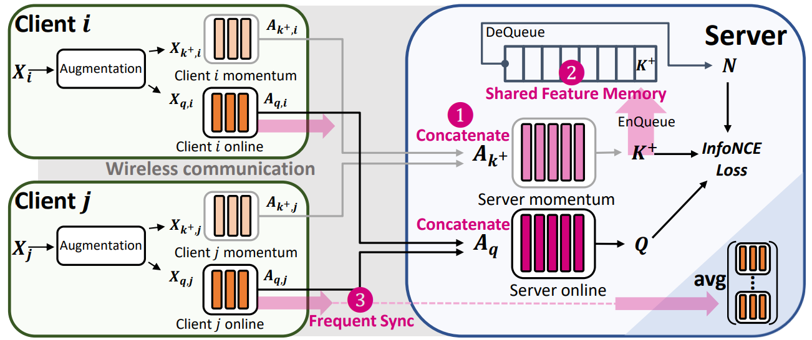

# MocoSFL

This repository implements MocoSFL, a collaborative SSL framework based on Split Federated Learning (SFL). In MocoSFL, the large backbone model is split into a small client-side model and a large server-side model, and only the small client-side model is processed locally on the client's local devices. Together with a smaller batch size enabled by MoCo and SFL's vector concatenation, the FLOPs and memory requirements are reduced by orders of magnitude. Moreover, MocoSFL naturally supports a shared feature memory to enable feature sharing, which provides abundant hard negative keys regardless of the quality and volume of local data. MocoSFL also achieves much better non-IID performance by using a small client-side model and increasing synchronization frequency. On CIFAR-10 with a 2-class-per-client non-IID distribution, we can achieve over ~84% linear probe accuracy with ResNet-18 and 1,000 clients joining simultaneously. The proposed scheme only costs <5MB of memory and <10MB of communication, measured on a Rasiberry Pi 4 device that consumes power less than 5W.


## Citation
please cite us using:
```
@misc{li2023mofosfl,
      title={MocoSFL: enabling cross-client collaborative self-supervised learning}, 
      author={Jingtao Li and Lingjuan Lyu and Daisuke Iso and Chaitali Chakrabarti and Michael Spranger},
      year={2023},
      eprint={https://openreview.net/pdf?id=2QGJXyMNoPz},
      archivePrefix={openreview}
}
```

## Getting Started

### Prerequisite:

Python > 3.7 with Pytorch, Torchvision

### Quick Example

#### Sample Experiment - Table 3:

```
bash scripts/table3/run_sflmoco_cross_client.sh
```

#### Hardware Demo:

On Raspberry Pi (configure IP in demo/demo_client_web.py):
```
cd demo
bash run_client.sh
```

On PC (configure IP in demo/demo_server_web.py):
```
cd demo
bash run_server.sh
```

## Project Structure

`/run_sflmoco.py` -- Source files for MocoSFL

`/run_sflmoco_taressfl.py` -- Source files for MocoSFL with Target ResSFL module

`/expert_target_aware` -- Pretrained taressfl checkpoin

`/scripts` -- Evaluation scripts used on a single-GPU machine

`/demo` -- Demo scripts for embedded devices

## Framework snapshots




## Contact
 
 If you have any questions regarding the code, please feel free to contact
 Jingtao Li (zlijingtao@gmail.com) or Lingjuan Lyu (Lingjuan.Lv@sony.com).
 
 
###### Copyright 2023, Sony AI, Sony Corporation of America, All rights reserved.